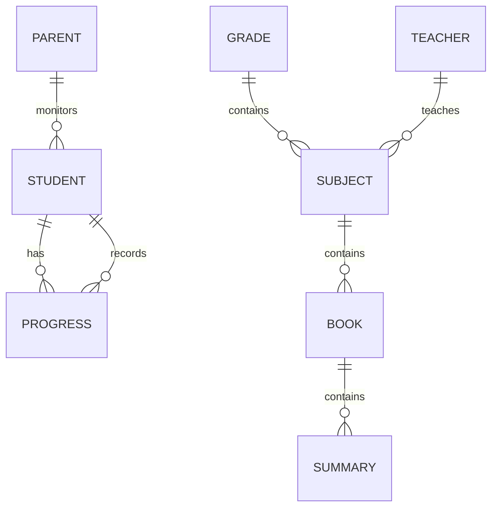
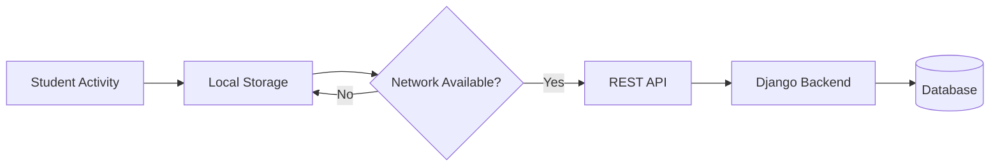
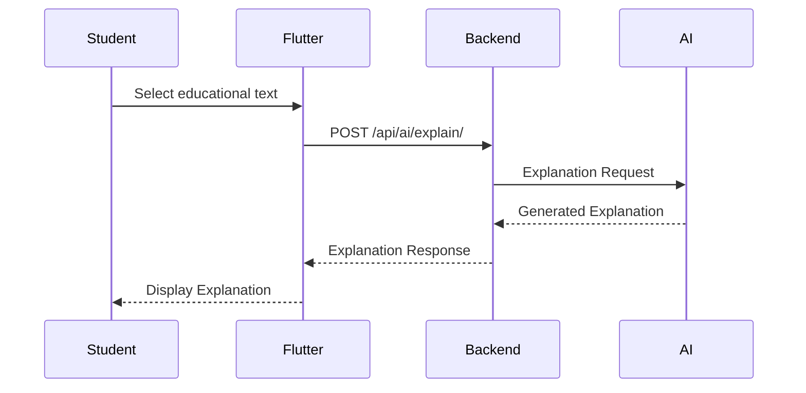
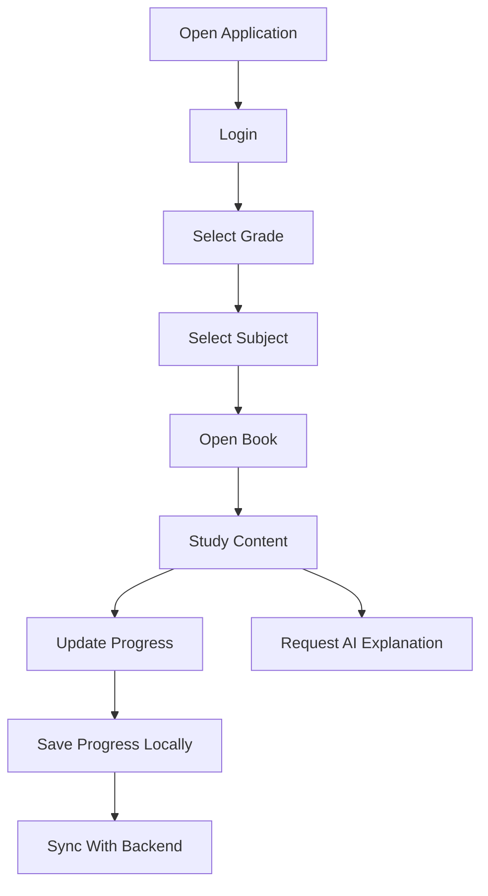
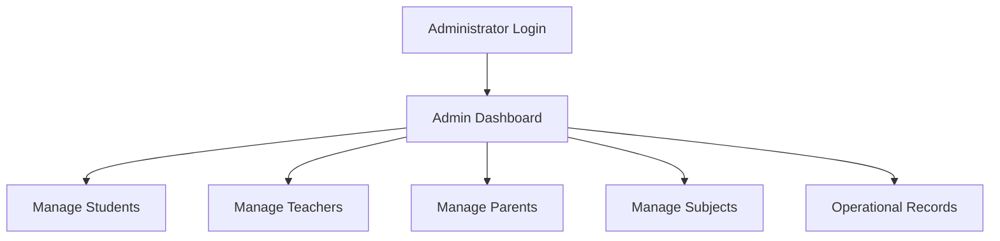
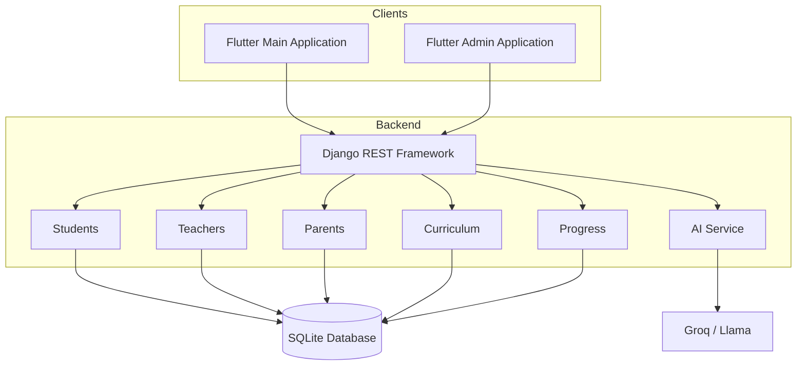

# ADRES — Educational Platform for Yemeni Students

<p align="center">
  <strong>A Multi-Application Educational Platform for Yemeni Students</strong>
</p>

<p align="center">
  Flutter • Django REST Framework • SQLite • AI Integration • Offline-First
</p>

<p align="center">
  
  
  
  
  
  
</p>

---

## 📚 Table of Contents

- [Overview](#-overview)
- [Problem Statement](#-problem-statement)
- [Solution](#-solution)
- [Project Objectives](#-project-objectives)
- [System Overview](#-system-overview)
- [Applications](#-applications)
- [Key Features](#-key-features)
- [System Architecture](#-system-architecture)
- [Application Architecture](#-application-architecture)
- [Backend Architecture](#-backend-architecture)
- [Database Design](#-database-design)
- [REST API](#-rest-api)
- [Authentication & User Roles](#-authentication--user-roles)
- [Curriculum Management](#-curriculum-management)
- [Student Progress Tracking](#-student-progress-tracking)
- [Offline-First Architecture](#-offline-first-architecture)
- [Data Synchronization](#-data-synchronization)
- [AI-Powered Explanations](#-ai-powered-explanations)
- [User Workflows](#-user-workflows)
- [Project Structure](#-project-structure)
- [Technology Stack](#-technology-stack)
- [Installation & Setup](#-installation--setup)
- [Environment Configuration](#-environment-configuration)
- [Running the Project](#-running-the-project)
- [Security Considerations](#-security-considerations)
- [Current Limitations](#-current-limitations)
- [Future Improvements](#-future-improvements)
- [Team Project](#-team-project)
- [My Contribution](#-my-contribution)
- [Project Status](#-project-status)
- [Documentation](#-documentation)
- [Author](#-author)

---

# 📖 Overview

**ADRES** is a graduation project designed as an educational platform for Yemeni students.

The platform provides students with digital access to educational content and school curriculum materials while allowing them to track their learning progress.

The system is built as a multi-application platform consisting of:

- A Flutter application for students, teachers, and parents.
- A separate Flutter administration application.
- A Django REST Framework backend.
- A database layer for users, curriculum, and progress.
- Local storage and synchronization mechanisms.
- An AI-powered educational explanation service.

The project was developed collaboratively as a **team graduation project**.

---

# 🎯 Problem Statement

Students need a convenient and accessible way to interact with educational content, read school materials, and follow their learning progress.

The project addresses several challenges:

- Digital access to educational materials.
- Organizing curriculum content.
- Tracking student learning progress.
- Supporting multiple user roles.
- Providing administrative management.
- Supporting learning in environments with unreliable connectivity.
- Providing additional explanations for difficult educational content.

---

# 💡 Solution

ADRES combines cross-platform Flutter applications with a Django REST backend.

The platform provides:

- Curriculum browsing.
- Educational content viewing.
- Student progress tracking.
- Local progress storage.
- Online synchronization.
- Teacher-related functionality.
- Parent-related functionality.
- Administrative management.
- AI-powered explanations.
- REST API communication.

---

# 🎯 Project Objectives

The main objectives of ADRES are:

- Build a digital educational platform for Yemeni students.
- Organize educational content into a structured curriculum.
- Provide different experiences for students, teachers, parents, and administrators.
- Track student learning progress.
- Support offline-first learning workflows.
- Synchronize local learning data with the backend.
- Provide AI-assisted explanations.
- Demonstrate a complete full-stack application architecture.

---

# 🏗 System Overview

ADRES follows a client-server architecture.

Multiple Flutter applications communicate with a centralized Django REST Framework backend.

```mermaid
flowchart TD

    Student[Student]
    Teacher[Teacher]
    Parent[Parent]
    Admin[Administrator]

    MainApp[Flutter Main Application]
    AdminApp[Flutter Admin Application]

    API[Django REST Framework API]

    DB[(SQLite Database)]

    Curriculum[Curriculum & Educational Content]
    Progress[Progress Tracking]
    AI[AI Explanation Service]

    Student --> MainApp
    Teacher --> MainApp
    Parent --> MainApp

    Admin --> AdminApp

    MainApp --> API
    AdminApp --> API

    API --> DB
    API --> Curriculum
    API --> Progress
    API --> AI

# 📱 Applications

ADRES consists of three major software components.

## 1. Main Flutter Application

Directory:

```text
adres_flutter_v1.0.1/
```

The main Flutter application provides experiences for:

* Students
* Teachers
* Parents

It communicates with the Django REST API and uses local storage for selected data.

---

## 2. Student Experience

Students can:

* Select their grade.
* Browse subjects.
* Access educational books.
* View educational summaries.
* Track their learning progress.
* Store progress locally.
* Synchronize progress with the backend.
* Select educational text.
* Request an AI-generated explanation.

The student experience focuses on providing simple access to curriculum content and learning progress.

---

## 3. Teacher Experience

The application includes teacher-related functionality connected to the backend teacher system.

Teacher information and related operations are managed through the REST API.

The backend provides the central data layer for teacher-related functionality.

---

## 4. Parent Experience

Parents are represented as a dedicated user role.

The system maintains relationships between parents and students through the backend data model and API.

This provides the foundation for parent-oriented educational monitoring and related functionality.

---

## 5. Administration Application

Directory:

```text
adres_admin_flutter/
```

The administration application is a separate Flutter client designed for platform management.

Administrators can manage:

* Students
* Teachers
* Parents
* Subjects
* Operational records

The administration application communicates with the same Django REST backend used by the main application.

---

# ✨ Key Features

## 📚 Curriculum Management

The platform organizes educational content using a structured curriculum hierarchy.

Conceptually:

```text
Grade
  │
  └── Subject
        │
        └── Book
              │
              └── Educational Content
                    │
                    └── Summary
```

The backend contains dedicated curriculum functionality for managing educational structures and content.

---

## 📈 Student Progress Tracking

The platform maintains learning progress separately from curriculum content.

Progress-related functionality includes:

* Recording learning activity.
* Storing progress locally.
* Synchronizing progress with the backend.
* Maintaining student progress records.

The separation between curriculum and progress allows educational content to remain independent from individual student activity.

---

## 💾 Local Storage

The Flutter application uses local storage to maintain selected information.

Technologies include:

* Hive
* Hive Flutter

Local storage is particularly important for the application's offline-first learning workflow.

---

## 🌐 Connectivity Detection

The application uses:

```text
connectivity_plus
```

to detect network connectivity.

This allows the application to determine when backend synchronization can be attempted.

---

## 📖 Educational Content

Educational books and HTML-based learning content can be displayed inside the Flutter application.

The project uses:

```text
webview_flutter
```

to display web-based educational materials.

---

# 🏛 System Architecture

The high-level architecture consists of three layers:

```text
┌─────────────────────────────────────────┐
│              Client Layer               │
│                                         │
│  Flutter Main App    Flutter Admin App  │
└───────────────────┬─────────────────────┘
                    │
                 REST API
                    │
┌───────────────────▼─────────────────────┐
│             Application Layer           │
│                                         │
│        Django REST Framework            │
│                                         │
│ Students • Teachers • Parents           │
│ Curriculum • Progress • AI              │
└───────────────────┬─────────────────────┘
                    │
┌───────────────────▼─────────────────────┐
│               Data Layer                │
│                                         │
│              SQLite Database            │
└─────────────────────────────────────────┘
```

---

# 🧩 Application Architecture

The Flutter applications are organized into reusable components such as:

Flutter Application
│
├── Core
│   ├── Configuration
│   ├── Services
│   ├── Storage
│   └── Utilities
│
├── Features
│   ├── Authentication
│   ├── Students
│   ├── Teachers
│   ├── Parents
│   ├── Curriculum
│   ├── Progress
│   └── AI
│
├── Widgets
│
└── Main Entry Point
The repository contains additional screens, models, services, assets, and feature-specific components.

---

# 🧠 Backend Architecture

The backend is implemented using:

* Python
* Django
* Django REST Framework

The backend is divided into domain-focused Django applications.

Major areas include:

```text
Backend
│
├── Students
├── Teachers
├── Parents
├── Curriculum
├── Progress
├── Summaries
└── AI Services
```

This modular structure separates major business domains and provides a central API for the Flutter clients.

---

# 🗄 Database Design

The current implementation uses **SQLite**.

The database represents the main entities required by the educational platform.

Conceptually:



The actual Django models provide the implementation of these relationships.

---

# 🌐 REST API

The Flutter applications communicate with the backend through REST APIs.

Django REST Framework provides the API layer responsible for:

* Student operations.
* Teacher operations.
* Parent operations.
* Curriculum operations.
* Progress operations.
* AI explanation requests.
* Administrative operations.

The applications communicate using HTTP and JSON.

Example AI endpoint:

```http
POST /api/ai/explain/
```

---

# 🔐 Authentication & User Roles

The platform is designed around multiple user roles:

```text
                ADRES
                  │
       ┌──────────┼──────────┐
       │          │          │
    Student    Teacher     Parent
       │          │          │
       └──────────┼──────────┘
                  │
            Main Flutter App
                  │
                  ▼
          Django REST API
                  ▲
                  │
             Admin App
                  │
             Administrator
```

Each role has its own responsibilities and application functionality.

---

# 📚 Curriculum Management

The curriculum system provides a structured representation of educational materials.

The application supports multiple grade levels and organizes educational resources by:

* Grade
* Subject
* Book
* Educational content
* Summaries

The project also contains HTML-based educational resources that can be rendered through the Flutter application.

---

# 📊 Student Progress Tracking

Student progress is maintained independently from curriculum content.

A simplified workflow is:

```text
Student
   │
   ▼
Learning Activity
   │
   ▼
Local Progress
   │
   ├───────────────┐
   │               │
 Offline          Online
   │               │
   ▼               ▼
Local Storage    REST API
                   │
                   ▼
                Backend
                   │
                   ▼
               Database
```

This allows the application to preserve learning activity locally and synchronize it when connectivity is available.

---

# 📡 Offline-First Architecture

Offline support is an important part of the application design.

The application uses local persistence to allow selected learning data to remain available when the network is unavailable.

The main technologies involved are:

* Hive
* Hive Flutter
* Connectivity Plus

The general principle is:

> Store locally first, synchronize with the server when connectivity is available.

---

# 🔄 Data Synchronization

The synchronization workflow can be represented as:



This approach is intended to provide a more resilient learning experience in environments with intermittent connectivity.

---

# 🤖 AI-Powered Explanations

ADRES includes an AI-powered educational assistance feature.

Students can select educational text and request an explanation.

The communication flow is:



The backend integrates with the Groq API and a Llama-based model.

The AI feature is intended to assist students in understanding educational content.

---

# 🔄 User Workflows

## Student Workflow



---

## Administrator Workflow



---

# 📁 Project Structure

The repository is organized into three main applications:

```text
ADRES/
│
├── adres_backend_v1.0.1/
│   │
│   ├── config/
│   ├── students/
│   ├── teachers/
│   ├── parents/
│   ├── curriculum/
│   ├── progress/
│   ├── summaries/
│   ├── yemeni_school_backend/
│   ├── manage.py
│   └── requirements.txt
│
├── adres_flutter_v1.0.1/
│   │
│   ├── lib/
│   ├── assets/
│   ├── android/
│   ├── ios/
│   ├── web/
│   ├── windows/
│   ├── linux/
│   ├── macos/
│   └── pubspec.yaml
│
├── adres_admin_flutter/
│   │
│   ├── lib/
│   ├── assets/
│   └── pubspec.yaml
│
├── .github/
├── .gitignore
├── ADRES_FULL_DOCS.md
└── PROJECT_DOCS.md
```

---

# 🛠 Technology Stack

## Frontend

| Technology        | Purpose                                |
| ----------------- | -------------------------------------- |
| Flutter           | Cross-platform application development |
| Dart              | Application programming language       |
| HTTP              | REST API communication                 |
| Hive              | Local data storage                     |
| Hive Flutter      | Flutter local storage integration      |
| WebView           | Displaying educational HTML content    |
| Connectivity Plus | Network connectivity detection         |

---

## Backend

| Technology            | Purpose                      |
| --------------------- | ---------------------------- |
| Python                | Backend programming language |
| Django                | Backend framework            |
| Django REST Framework | REST API development         |
| SQLite                | Database                     |
| django-cors-headers   | Cross-origin configuration   |
| Groq API              | AI service integration       |
| Llama-based Model     | AI-powered explanations      |

---

# ⚙️ Installation & Setup

## Requirements

Install the following before running the project:

* Flutter SDK
* Dart SDK
* Python 3.x
* pip
* Backend dependencies

Verify Flutter:

```bash
flutter --version
```

Verify Python:

```bash
python --version
```

---

# 🐍 Backend Setup

Navigate to the backend directory:

```bash
cd adres_backend_v1.0.1
```

Create a virtual environment:

```bash
python -m venv venv
```

Activate it on Windows:

```bash
venv\Scripts\activate
```

Install dependencies:

```bash
pip install -r requirements.txt
```

Run database migrations:

```bash
python manage.py migrate
```

Start the development server:

```bash
python manage.py runserver
```

The development server is normally available at:

```text
http://127.0.0.1:8000/
```

---

# 📱 Main Flutter Application

Navigate to:

```bash
cd adres_flutter_v1.0.1
```

Install Flutter dependencies:

```bash
flutter pub get
```

Run the application:

```bash
flutter run
```

---

# 🛠 Administration Application

Navigate to:

```bash
cd adres_admin_flutter
```

Install dependencies:

```bash
flutter pub get
```

Run:

```bash
flutter run
```

---

# 🔐 Environment Configuration

Sensitive configuration should be supplied through local environment configuration.

Example:

```env
DJANGO_SECRET_KEY=your-secret-key
GROQ_API_KEY=your-groq-api-key
```

Never commit real credentials to the repository.

Do not commit:

* API keys
* Passwords
* Secret keys
* Private credentials
* Production environment files

---

# 🔒 Security Considerations

ADRES is an academic graduation-project implementation.

The current implementation requires additional security hardening before production deployment.

Important areas include:

### Authentication

Production deployment should use a stronger authentication mechanism.

### Authorization

API permissions should be restricted according to user roles and required operations.

### Password Security

User credentials should always be handled using secure password hashing and production-grade authentication practices.

### CORS

Production environments should use restrictive CORS policies instead of development-oriented configurations.

### Secrets

API keys and application secrets should be stored securely using environment variables or a dedicated secrets-management solution.

### HTTPS

Production deployments should use HTTPS for secure communication between clients and backend services.

---

# ⚠️ Current Limitations

The current version is primarily an academic implementation.

Known areas for improvement include:

* Production-grade authentication.
* More granular API permissions.
* Stronger authorization policies.
* Production database configuration.
* Secure deployment configuration.
* Expanded automated testing.
* More robust synchronization conflict handling.
* Production monitoring and logging.

These limitations are documented intentionally and should be addressed before production deployment.

---

# 🚀 Future Improvements

Possible future improvements include:

* JWT-based authentication.
* Advanced role-based access control.
* PostgreSQL for production environments.
* HTTPS deployment.
* Cloud deployment.
* Push notifications.
* Advanced teacher dashboards.
* Improved parent dashboards.
* Detailed learning analytics.
* Enhanced AI educational assistance.
* Automated API testing.
* Flutter widget and integration testing.
* CI/CD pipelines.
* Application monitoring.
* Improved caching.
* Advanced offline synchronization.
* Scalable media and file storage.

---

# 👥 Team Project

ADRES was developed as a **team graduation project**.

The system combines several areas of software engineering:

* Cross-platform mobile development.
* Backend development.
* REST API development.
* Database modeling.
* Curriculum management.
* Offline-first data handling.
* Data synchronization.
* AI integration.
* Administrative application development.

The repository represents the broader team project and should be understood as a collaborative software project.

---

# 👨‍💻 My Contribution

My contribution to ADRES focused on software development across the application stack.

Areas of contribution included:

* Flutter application development.
* Dart application logic.
* REST API integration.
* Backend/API communication.
* Application services.
* Local data handling.
* Progress-related functionality.
* Integration between frontend applications and backend services.
* Debugging and application improvements.
* Participation in the overall system development.

The project was developed collaboratively, with responsibilities distributed among team members.

---

# 🧠 Technical Skills Demonstrated

ADRES demonstrates practical experience in:

## Frontend Development

* Flutter
* Dart
* Cross-platform development
* UI development
* Navigation
* Application services
* REST API integration
* Local persistence

## Backend Development

* Python
* Django
* Django REST Framework
* REST API design
* Database modeling
* Business logic

## Full-Stack Integration

```text
Flutter Applications
        │
        │ HTTP / JSON
        ▼
Django REST Framework
        │
        ▼
SQLite Database
```

## Additional Engineering Concepts

* Offline-first architecture
* Local data persistence
* Data synchronization
* Multi-role applications
* Modular architecture
* AI service integration
* Administrative systems
* Educational content management

---

# 📊 Architecture Summary



---

# 📌 Project Status

**Status:** Completed Graduation Project / Academic Implementation

ADRES represents a complete academic full-stack platform combining:

* Multiple Flutter applications.
* Django REST Framework backend.
* Database-backed APIs.
* Curriculum management.
* Progress tracking.
* Offline-first local storage.
* Data synchronization.
* AI-powered educational assistance.
* Administrative management.

The current implementation provides a strong foundation for further production-oriented development and security hardening.

---

# 📄 Documentation

Additional technical documentation is included in the repository:

```text
ADRES_FULL_DOCS.md
PROJECT_DOCS.md
```

These documents contain additional information about the project's implementation, architecture, configuration, and functionality.

---

# 👤 Author

## Saqr Ameen Al-Dhafree

**Full Stack Developer**

Flutter & Dart • Backend Development • REST APIs

### GitHub

[https://github.com/SaqrAminAL-Dhafree](https://github.com/SaqrAminAL-Dhafree)

### LinkedIn

[https://linkedin.com/in/saqraldhafree](https://linkedin.com/in/saqraldhafree)

---

# ⭐ About This Project

ADRES demonstrates the development of a multi-application educational platform combining Flutter and Django REST Framework with local persistence, synchronization, database-backed APIs, curriculum management, administrative tools, and AI-powered educational assistance.

The project was developed as a collaborative graduation project and represents practical experience in full-stack application development.

---

```
```
